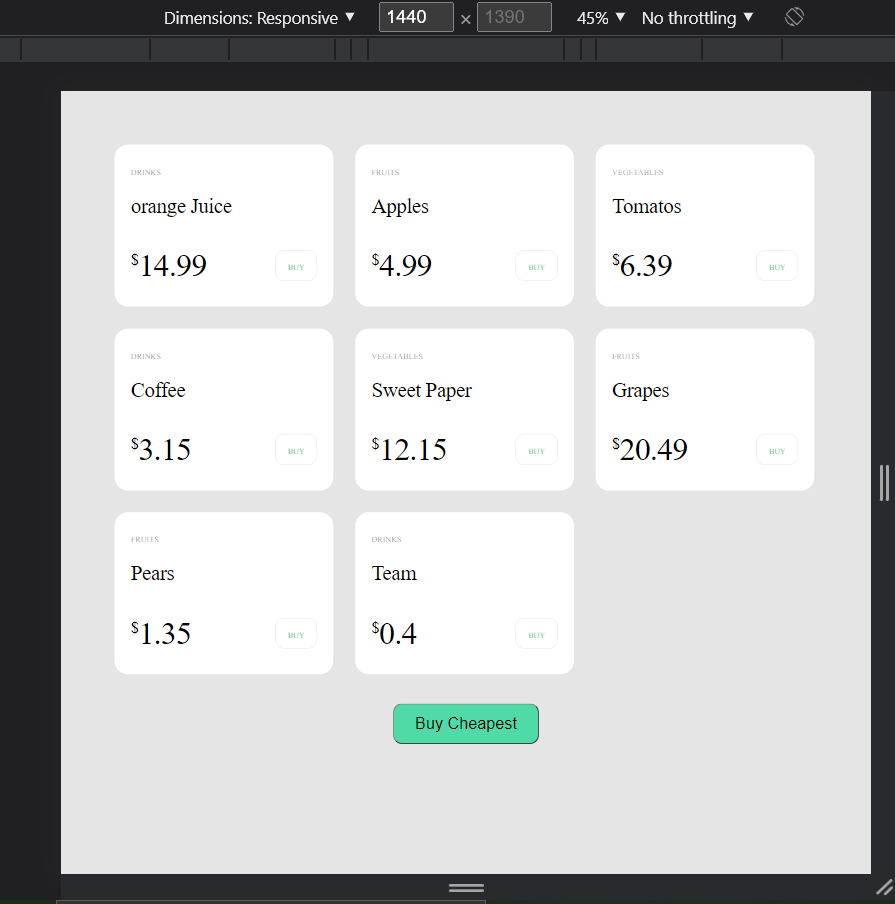
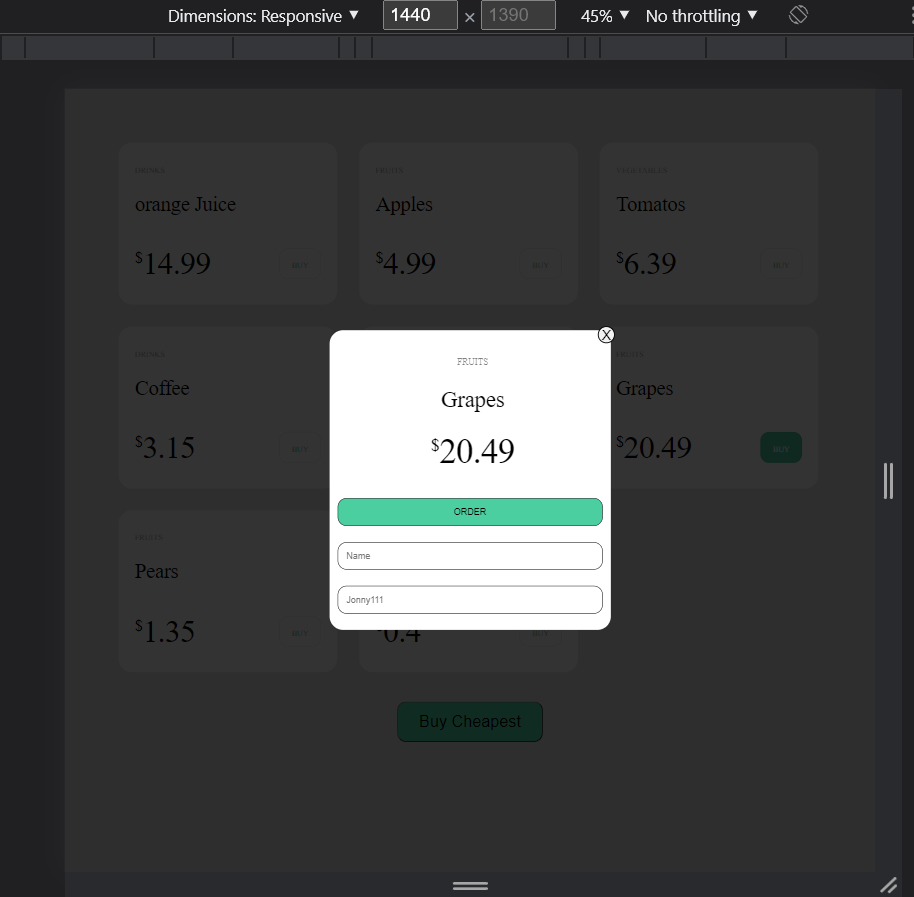
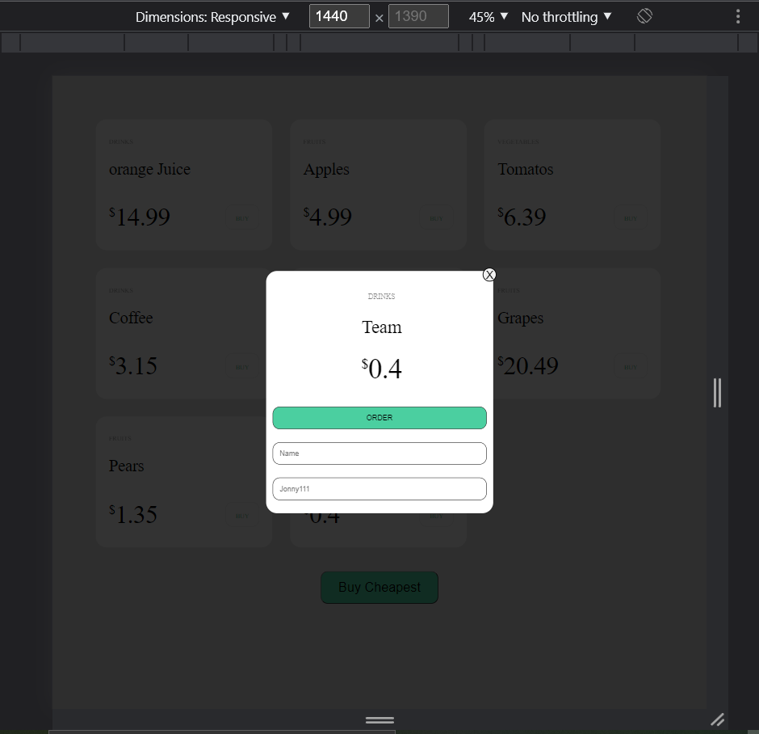

1) Install MongoDB (https://docs.mongodb.com/manual/administration/install-community/)

2) Install server & client dependencies ```npm i && cd client && npm i && cd ../```

3) Install node-mongo-seeds ```npm i -g node-mongo-seeds```

4) Seed database ```seed```

5) Run dev server ```npm start```


///////////////////////////////////////////////////////////////////////////////////////////////

wrote on front and back side

how it looks





